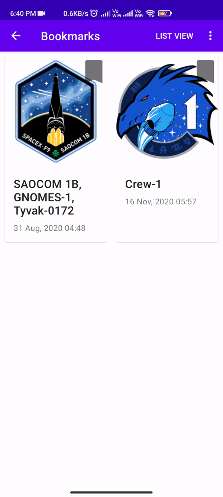

# Spacex_using_GraphQL
I'm using GraphQL for getting API Response, while saving bookmarks into offline database using Room.
## About
This app uses Navigation Component for fragment navigations, MVVM Architecture, Room Database for saving bookmarks, Glide library, Asynctask, Apollo Graph for server connection, and <a href = '#Used'>Much More </a>
### Installing
Open android studio -> import from vcs -> run.

## Preview
<table>
  
  <tr>
    <td>  </td>
    <td> <h2> Api Response & Bookmarks</h2>  Used <a href = 'https://api.spacex.land/graphql/'> graphQL Server</a> response for data, Bookmarks are stored in Room and shared between listing and bookmarks fragment making it available for offline view. </td>
  </tr>
  
  <tr>
    <td> <h2> Grid View To List View</h2>  Switch between list view and grid view, The switch is maintain in entire application. While saving state of list before leaving the Fragment</td>
    <td>  </td>
  </tr>
  
  <tr>
    <td>   &emsp;   </td>
    <td> <h2> Go to Details</h2>   carousel list view is created without using external Libary, While displaying Details of the launch from ListFragment and BookmarkFragment respectively</td>
  </tr>
   
   <tr>
    <td> <h2> Sort List</h2>  We can sort the launch on base of launch date or mission name while keeping bookmarks and List view type in place</td>
    <td>  </td>
  </tr>
  
  <tr>
    <td>  </td>
    <td> <h2> No Internet</h2>   We can view bookmarks even without internet</td>
  </tr>
  
</table>

 
## Projects Uses
- Apollo GraphQL (for api response from GraphQL server )
- Saving bookmarks (Room Database)
- MVVM
- Effective fragment management
- AsyncTasks
- SharedPreferences
- Effective communication with interfaces
- Navigation Component
- Glide library to download bitmaps
- RecyclerViews
- And much more...
